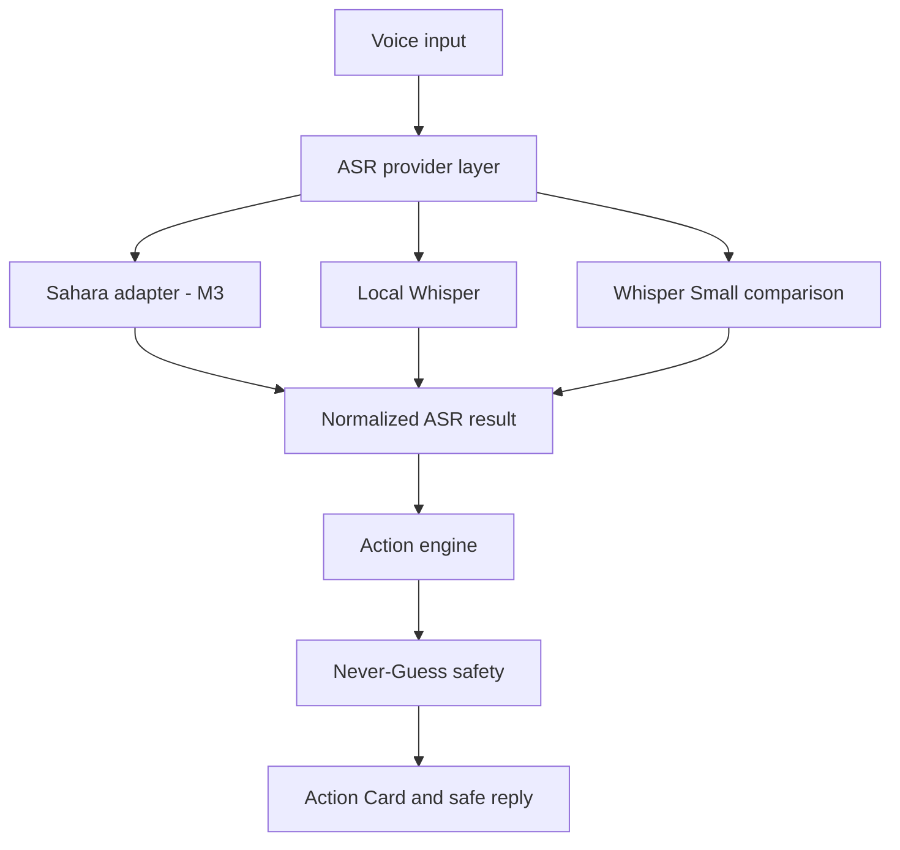

# VoiceBridge Architecture

VoiceBridge separates speech recognition from the business-action system. Sahara and Whisper produce normalized transcript data; neither engine owns downstream business decisions.

## Module ownership

- `app.py`: upload orchestration, compatibility wrapper and HTTP endpoints.
- `action_engine.py`: VoiceBridge-owned language cues, intent taxonomy, entity extraction, field-level safety policy, missing-information analysis, required action and safe response composition.
- `templates/index.html`: editable transcript/meaning and customer-operations Action Card.
- `speech_engines/`: provider-independent result contract, Whisper adapter, explicit unavailable-provider placeholders, and credit-protecting provider cache primitives.
- `benchmark/`: manifest validation, identical cross-engine execution, speech metrics, action/safety metrics and machine-readable reports.

## Current boundary

M1 uses deterministic, inspectable extraction rules, while M2 attaches provider-independent safety states to critical fields. M2.5 makes the transcript contract and evaluation harness provider-neutral. Product fallback and benchmark execution are deliberately separate: product mode may offer Whisper when a connected provider is unavailable, but benchmark mode records the requested provider as failed and never substitutes another engine. M2.9 adds content-addressed result caching so successful remote calls cannot be repeated accidentally. M3 integrates Sahara behind the existing interface without changing the action schema or inventing provider fields. M3.1 compares Sahara, Large-v3 and Small on one frozen AfriSwitch subset and preserves terminal provider failure in the denominator.