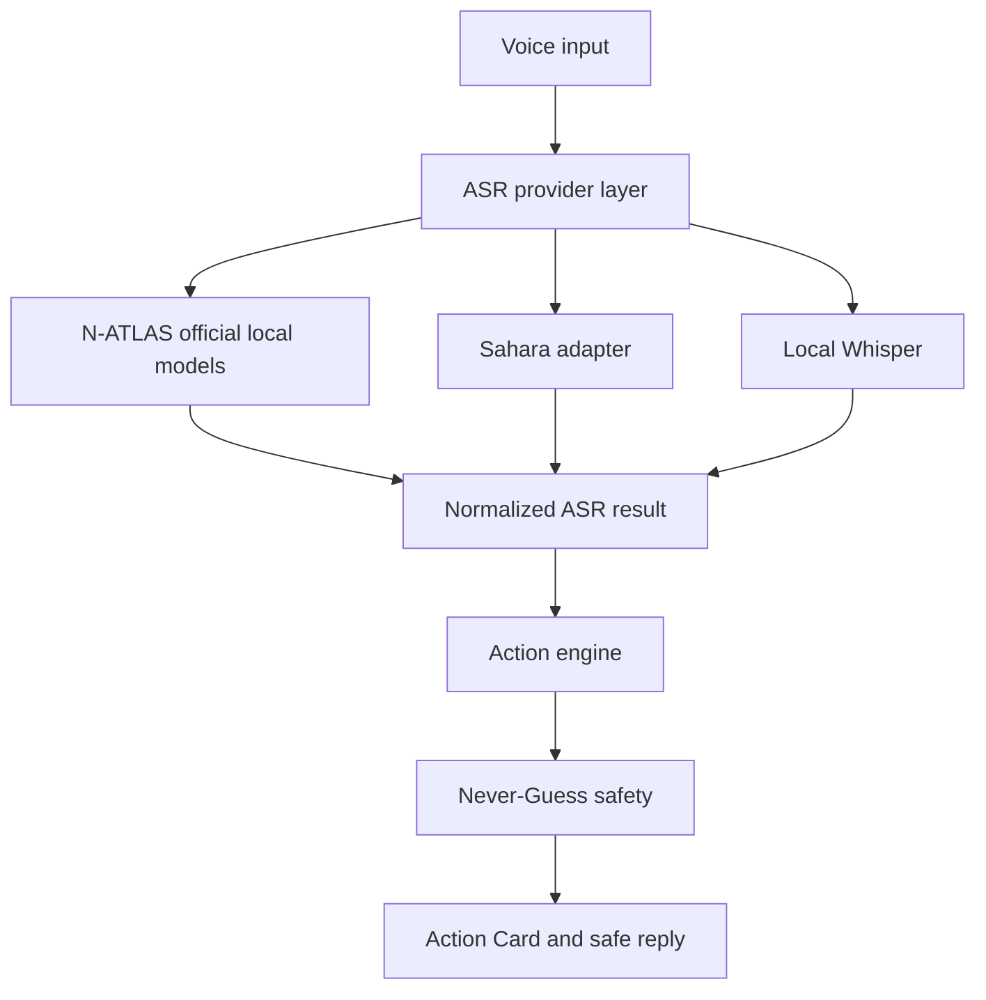

# VoiceBridge Architecture

VoiceBridge separates speech recognition from the business-action system. N-ATLAS, Sahara and Whisper produce normalized transcript data; no speech engine owns downstream business decisions.

```mermaid
flowchart TD
    A[Voice input] --> B[ASR provider layer]
    B --> C[N-ATLAS official local models]
    B --> D[Sahara adapter]
    B --> E[Local Whisper]
    C --> F[Normalized ASR result]
    D --> F
    E --> F
    F --> G[Action engine]
    G --> H[Never-Guess safety]
    H --> I[Action Card and safe reply]
```

## Module ownership

- `app.py`: upload orchestration, compatibility wrapper and HTTP endpoints.
- `action_engine.py`: VoiceBridge-owned language cues, intent taxonomy, entity extraction, field-level safety policy, missing-information analysis, required action and safe response composition.
- `templates/index.html`: editable transcript/meaning and customer-operations Action Card.
- `speech_engines/`: provider-independent result contract, Whisper adapter, explicit unavailable-provider placeholders, and credit-protecting provider cache primitives.
- `benchmark/`: manifest validation, identical cross-engine execution, speech metrics, action/safety metrics and machine-readable reports.

## Current boundary

M1 uses deterministic, inspectable extraction rules, while M2 attaches provider-independent safety states to critical fields. M2.5 makes the transcript contract and evaluation harness provider-neutral. Product fallback and benchmark execution are deliberately separate: product mode may offer Whisper when a connected provider is unavailable, but benchmark mode records the requested provider as failed and never substitutes another engine. M2.9 adds content-addressed result caching so successful remote calls cannot be repeated accidentally. M3 integrates Sahara behind the existing interface without changing the action schema or inventing provider fields. M3.1 compares Sahara, Large-v3 and Small on one frozen AfriSwitch subset and preserves terminal provider failure in the denominator.

## Text provenance

The current product path performs two distinct faster-whisper passes: a
transcription pass and a second English-translation pass. These outputs are not
interchangeable. Future providers must preserve three separate provenance
stages: the ASR provider transcript, the component responsible for any English
meaning/translation, and text corrected by the user. A provider must never be
credited with translation it did not perform.

## NAIC application integration

The NAIC build defaults to explicitly selected N-ATLAS transcription. Only the
implemented Yoruba and Nigerian-accented English model mappings are exposed.
Whisper remains a separate explicit choice and is never invoked as an automatic
ASR fallback. A Yoruba N-ATLAS run may use a separately labelled local Whisper
translation pass; the immutable raw N-ATLAS transcript is retained alongside
the editable working transcript and English meaning. Provider failures and the
30-second N-ATLAS limit remain visible to the user rather than triggering
silent rerouting, truncation or chunking.
